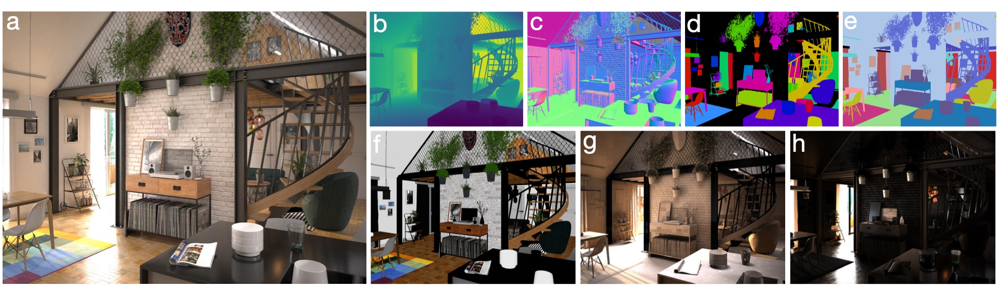

# The Hypersim Dataset

For many fundamental scene understanding tasks, it is difficult or impossible to obtain per-pixel ground truth labels from real images. We address this challenge by introducing Hypersim, a photorealistic synthetic dataset for holistic indoor scene understanding. To create our dataset, we leverage a large repository of synthetic scenes created by professional artists, and we generate 77,400 images of 461 indoor scenes with detailed per-pixel labels and corresponding ground truth geometry. Our dataset: (1) relies exclusively on publicly available 3D assets; (2) includes complete scene geometry, material information, and lighting information for every scene; (3) includes dense per-pixel semantic instance segmentations and complete camera information for every image; and (4) factors every image into diffuse reflectance, diffuse illumination, and a non-diffuse residual term that captures view-dependent lighting effects.

The Hypersim Dataset is licensed under the [Creative Commons Attribution-ShareAlike 3.0 Unported License](http://creativecommons.org/licenses/by-sa/3.0/).

&nbsp;
## Citation

If you find the Hypersim Dataset or the Hypersim Toolkit useful in your research, please cite the following [paper](https://arxiv.org/abs/2011.02523):

```
@inproceedings{roberts:2021,
    author    = {Mike Roberts AND Jason Ramapuram AND Anurag Ranjan AND Atulit Kumar AND
                 Miguel Angel Bautista AND Nathan Paczan AND Russ Webb AND Joshua M. Susskind},
    title     = {{Hypersim}: {A} Photorealistic Synthetic Dataset for Holistic Indoor Scene Understanding},
    booktitle = {International Conference on Computer Vision (ICCV) 2021},
    year      = {2021}
}
```

&nbsp;
## Downloading the Hypersim Dataset

To obtain our image dataset, you can run the following download script. On Windows, you'll need to modify the script so it doesn't depend on the `curl` and `unzip` command-line utilities.

```
python code/python/tools/dataset_download_images.py --downloads_dir /Volumes/portable_hard_drive/downloads --decompress_dir /Volumes/portable_hard_drive/evermotion_dataset/scenes
```

Note that our dataset is roughly 1.9TB. We have partitioned the dataset into a few hundred separate ZIP files, where each ZIP file is between 1GB and 20GB. Our [download script](code/python/tools/dataset_download_images.py) contains the URLs for each ZIP file. [Thomas Germer](https://github.com/99991) has generously contributed an [alternative download script](contrib/99991) that can be used to download subsets of files from within each ZIP archive.

Note also that we manually excluded images containing people and prominent logos from our public release, and therefore our public release contains 74,619 images, rather than 77,400 images. We list all the images we manually excluded in `ml-hypersim/evermotion_dataset/analysis/metadata_images.csv`.

To obtain the ground truth triangle meshes for each scene, you must purchase the asset files [here](https://www.turbosquid.com/Search/3D-Models?include_artist=evermotion).

&nbsp;
## Working with the Hypersim Dataset

The Hypersim Dataset consists of a collection of synthetic scenes. Each scene has a name of the form `ai_VVV_NNN` where `VVV` is the volume number, and `NNN` is the scene number within the volume. For each scene, there are one or more camera trajectories named {`cam_00`, `cam_01`, ...}. Each camera trajectory has one or more images named {`frame.0000`, `frame.0001`, ...}. Each scene is stored in its own ZIP file according to the following data layout:

```
ai_VVV_NNN
├── _detail
│   ├── metadata_cameras.csv                     # list of all the camera trajectories for this scene
│   ├── metadata_node_strings.csv                # all human-readable strings in the definition of each V-Ray node
│   ├── metadata_nodes.csv                       # establishes a correspondence between the object names in an exported OBJ file, and the V-Ray node IDs that are stored in our render_entity_id images
│   ├── metadata_scene.csv                       # includes the scale factor to convert asset units into meters
│   ├── cam_XX                                   # camera trajectory information
│   │   ├── camera_keyframe_orientations.hdf5    # camera orientations
│   │   └── camera_keyframe_positions.hdf5       # camera positions (in asset coordinates)
│   ├── ...
│   └── mesh                                                                            # mesh information
│       ├── mesh_objects_si.hdf5                                                        # NYU40 semantic label for each object ID (available in our public code repository)
│       ├── mesh_objects_sii.hdf5                                                       # semantic instance ID for each object ID (available in our public code repository)
│       ├── metadata_objects.csv                                                        # object name for each object ID (available in our public code repository)
│       ├── metadata_scene_annotation_tool.log                                          # log of the time spent annotating each scene (available in our public code repository)
│       ├── metadata_semantic_instance_bounding_box_object_aligned_2d_extents.hdf5      # length (in asset units) of each dimension of the 3D bounding for each semantic instance ID
│       ├── metadata_semantic_instance_bounding_box_object_aligned_2d_orientations.hdf5 # orientation of the 3D bounding box for each semantic instance ID
│       └── metadata_semantic_instance_bounding_box_object_aligned_2d_positions.hdf5    # position (in asset coordinates) of the 3D bounding box for each semantic instance ID
└── images
    ├── scene_cam_XX_final_hdf5                  # lossless HDR image data that requires accurate shading
    │   ├── frame.IIII.color.hdf5                # color image before any tone mapping has been applied
    │   ├── frame.IIII.diffuse_illumination.hdf5 # diffuse illumination
    │   ├── frame.IIII.diffuse_reflectance.hdf5  # diffuse reflectance (many authors refer to this modality as "albedo")
    │   ├── frame.IIII.residual.hdf5             # non-diffuse residual
    │   └── ...
    ├── scene_cam_XX_final_preview               # preview images
    |   └── ...
    ├── scene_cam_XX_geometry_hdf5               # lossless HDR image data that does not require accurate shading
    │   ├── frame.IIII.depth_meters.hdf5         # Euclidean distances (in meters) to the optical center of the camera
    │   ├── frame.IIII.position.hdf5             # world-space positions (in asset coordinates)
    │   ├── frame.IIII.normal_cam.hdf5           # surface normals in camera-space (ignores bump mapping)
    │   ├── frame.IIII.normal_world.hdf5         # surface normals in world-space (ignores bump mapping)
    │   ├── frame.IIII.normal_bump_cam.hdf5      # surface normals in camera-space (takes bump mapping into account)
    │   ├── frame.IIII.normal_bump_world.hdf5    # surface normals in world-space (takes bump mapping into account)
    │   ├── frame.IIII.render_entity_id.hdf5     # fine-grained segmentation where each V-Ray node has a unique ID
    │   ├── frame.IIII.semantic.hdf5             # NYU40 semantic labels
    │   ├── frame.IIII.semantic_instance.hdf5    # semantic instance IDs
    │   ├── frame.IIII.tex_coord.hdf5            # texture coordinates
    │   └── ...
    ├── scene_cam_XX_geometry_preview            # preview images
    |   └── ...
    └── ...
```

### Dataset split

We include a standard train/val/test split in `ml-hypersim/evermotion_dataset/analysis/metadata_images_split_scene_v1.csv`. We refer to this split as the _v1_ split of our dataset. We generated this split by randomly partitioning our data at the granularity of scenes, rather than images or camera trajectories, to minimize the probability of very similar images ending up in different partitions. In order to maximize reproducibilty, we only include publicly released images in our split.

In the Hypersim dataset, there is a small amount of asset reuse across scenes. This asset reuse is difficult to detect by analyzing metadata in the original scene assets, but it is evident when manually browsing through our rendered images. We do not attempt to address this issue when generating our split. Therefore, individual objects in our training images are occasionally also present in our validation and test images.

### Coordinate conventions

We store positions in _asset coordinates_ (and lengths in _asset units_) unless explicitly noted otherwise. By _asset coordinates_, we mean the world-space coordinate system defined by the artist when they originally created the assets. In general, asset units are not the same as meters. To convert a distance in asset units to a distance in meters, use the `meters_per_asset_unit` scale factor defined in `ai_VVV_NNN/_detail/metadata_scene.csv`.

We store orientations as 3x3 rotation matrices that map points to world-space from object-space, assuming that points are stored as [x,y,z] column vectors. Our convention for storing camera orientations is that the camera's positive x-axis points right, the positive y-axis points up, and the positive z-axis points away from where the camera is looking.

### Lossless high-dynamic range images

Images for each camera trajectory are stored as lossless high-dynamic range HDF5 files in `ai_VVV_NNN/images/scene_cam_XX_final_hdf5` and `ai_VVV_NNN/images/scene_cam_XX_geometry_hdf5`.

Our `depth_meters` images contain Euclidean distances (in meters) to the optical center of the camera (perhaps a better name for these images would be `distance_from_camera_meters`). In other words, these images do not contain planar depth values, i.e., negative z-coordinates in camera-space. [Simon Niklaus](https://github.com/sniklaus) has generously contributed a [self-contained code snippet](https://github.com/apple/ml-hypersim/issues/9#issuecomment-754935697) for converting our `depth_meters` images into planar depth images. Because our `depth_meters` images contain distances in meters, but our camera positions are stored in asset coordinates, you need to convert our `depth_meters` images into asset units before performing calculations that involve camera positions (or any other positions that are stored in asset coordinates, e.g., bounding box positions).

Our `position` images contain world-space positions specified in asset coordinates.

Our `color`, `diffuse_illumination`, `diffuse_reflectance`, and `residual` images adhere with very low error to the following equation:

```
color == (diffuse_reflectance * diffuse_illumination) + residual
```

Note that our `color`, `diffuse_illumination`, `diffuse_reflectance`, and `residual` images do not have any tone mapping applied to them. In order to use these images for downstream learning tasks, we recommend applying your own tone mapping operator to the images. We implement a simple tone mapping operator in `ml-hypersim/code/python/tools/scene_generate_images_tonemap.py`.

### Lossy preview images

We include lossy preview images in `ai_VVV_NNN/images/scene_cam_XX_final_preview` and `ai_VVV_NNN/images/scene_cam_XX_geometry_preview`. We do not recommend using these images for downstream learning tasks, but they are useful for debugging and manually browsing through the data.

### Camera trajectories

Each camera trajectory is stored as a dense list of camera poses in `ai_VVV_NNN/_detail/cam_XX` in the following files.

`camera_keyframe_orientations.hdf5` contains an Nx3x3 array of camera orientations, where N is the number of frames in the trajectory, and each orientation is represented as a 3x3 rotation matrix that maps points to world-space from camera-space, assuming that points are stored as [x,y,z] column vectors. The convention in the Hypersim Dataset is that the camera's positive x-axis points right, the positive y-axis points up, and the positive z-axis points away from where the camera is looking.

`camera_keyframe_positions.hdf5` contains an Nx3 array of camera positions, where N is the number of frames in the trajectory, and each position is stored in [x,y,z] order. These positions are specified in asset coordinates.

### Camera intrinsics

Each scene uses slightly different camera intrinsics for rendering. This behavior arises because some scenes use non-standard tilt-shift photography parameters in their scene definition files. In [`ml-hypersim/contrib/mikeroberts3000`](contrib/mikeroberts3000), we provide a modified perspective projection matrix for each scene that can be used as a drop-in replacement for the usual OpenGL perspective projection matrix, as well as example code for projecting world-space points into Hypersim images. We recommend browsing through this example code to better understand our camera pose conventions.

### 3D bounding boxes

We include a tight 9-DOF bounding box for each semantic instance in `ai_VVV_NNN/_detail/mesh`. We represent each bounding box as a position, a rotation matrix, and the length of each bounding box dimension. We store this information in the following files.

`metadata_semantic_instance_bounding_box_object_aligned_2d_extents.hdf5` contains an Nx3 array of lengths, where N is the number of semantic instances, and each row represents the length of the each bounding box dimension stored in [x,y,z] order. These lengths are specified in asset units.

`metadata_semantic_instance_bounding_box_object_aligned_2d_orientations.hdf5` contains an Nx3x3 array of orientations, where N is the number of semantic instances, and each orientation is represented as a 3x3 rotation matrix that maps points to world-space from object-space, assuming that points are stored as [x,y,z] column vectors.

`metadata_semantic_instance_bounding_box_object_aligned_2d_positions.hdf5` contains an Nx3 array of bounding box center positions, where N is the number of semantic instances, and each position is stored in [x,y,z] order. These positions are specified in asset coordinates.

We compute each bounding box's rotation matrix according to the following algorithm. We always set the positive z-axis of our rotation matrix to point up, i.e., to align with the world-space gravity vector. We then compute a 2D minimum-area bounding box in the world-space xy-plane. Once we have computed our minimum-area bounding box, we have 4 possible choices for the positive x-axis of our rotation matrix. To make this choice, we consider the vector from the bounding box's geometric center to the center-of-mass of the points used to compute the bounding box. We choose the direction (among our 4 possible choices) that most closely aligns with this vector as the positive x-axis of our rotation matrix. Finally, we set the positive y-axis to be our positive x-axis rotated by +90 degrees in the world-space xy-plane (i.e., so our rotation matrix will have a determinant of 1). This algorithm encourages that similar objects with semantically similar orientations will be assigned rotation matrices that are similar (i.e., the difference of their rotation matrices will have a small matrix norm).

Our code can be used to compute other types of bounding boxes (e.g., axis-aligned in world-space, minimum-volume), but we don't include these other types of bounding boxes in our public release.

We recommend browsing through `ml-hypersim/code/python/tools/scene_generate_images_bounding_box.py` to better understand our bounding box conventions. In this file, we generate an image that has per-instance 3D bounding boxes overlaid on top of a previously rendered image. This process involves loading a previously rendered image, loading the appropriate bounding boxes for that image, and projecting the world-space corners of each bounding box into the image.

### Mesh annotations

We include our mesh annotations in `ml-hypersim/evermotion_dataset/scenes/ai_VVV_NNN/_detail/mesh`. The exported OBJ file for each scene (which can be obtained by purchasing the original scene assets) partitions each scene into a flat list of low-level "objects". We manually group these low-level objects into semantically meaningful instances, and assign an NYU40 semantic label to each instance, using our custom scene annotation tool. We store our mesh annotation information in the following files.

`mesh_objects_si.hdf5` contains an array of length N, where N is the number of low-level objects in the exported OBJ file, and `mesh_objects_si[i]` is the NYU40 semantic label for the low-level object with `object_id == i`.

`mesh_objects_sii.hdf5` contains an array of length N, where N is the number of low-level objects in the exported OBJ file, and `mesh_objects_sii[i]` is the semantic instance ID for the low-level object with `object_id == i`.

`metadata_objects.csv` contains N text entries, where N is the number of low-level objects in the exported OBJ file, and `metadata_objects[i]` is the object name for the low-level object with `object_id == i`. This file establishes a correspondence between the object names in the exported OBJ file, and the object IDs used as indices in `mesh_objects_si.hdf5` and `mesh_objects_sii.hdf5`.

`metadata_scene_annotation_tool.log` contains a log of the time spent annotating each scene.

### Rendering costs

We include the cost of rendering each image in our dataset in `ml-hypersim/evermotion_dataset/analysis/metadata_rendering_tasks.csv`. We include this rendering metadata so the marginal value and marginal cost of each image can be analyzed jointly in downstream applications.

In our pipeline, we divide rendering into 3 passes per image. Each rendering pass for each image in each camera trajectory corresponds to a particular rendering "task", and the costs in `metadata_rendering_tasks.csv` are specified per task. To compute the total cost of rendering the image `frame.IIII` in the camera trajectory `cam_XX` in the scene `ai_VVV_NNN`, we add up the `vray_cost_dollars` and `cloud_cost_dollars` columns for the rows where `job_name is in {ai_VVV_NNN@scene_cam_XX_geometry, ai_VVV_NNN@scene_cam_XX_pre, ai_VVV_NNN@scene_cam_XX_final} and task_id == IIII`.

&nbsp;
# The Hypersim Toolkit

The Hypersim Toolkit is a set of tools for generating photorealistic synthetic datasets from V-Ray scenes. By building on top of V-Ray, the datasets generated using the Hypersim Toolkit can leverage advanced rendering effects (e.g., rolling shutter, motion and defocus blur, chromatic aberration), as well as abundant high-quality 3D content from online marketplaces.

The Hypersim Toolkit consists of tools that operate at two distinct levels of abstraction. The _Hypersim Low-Level Toolkit_ is concerned with manipulating individual V-Ray scene files. The _Hypersim High-Level Toolkit_ is concerned with manipulating collections of scenes. You can use the Hypersim Low-Level Toolkit to output richly annotated ground truth labels, programmatically specify camera trajectories and custom lens distortion models, and programmatically insert geometry into a scene. You can use the Hypersim High-Level Toolkit to generate collision-free camera trajectories that are biased towards the salient parts of a scene, and interactively apply semantic labels to scenes.

&nbsp;
## Disclaimer

This software depends on several open-source projects. Some of the dependent projects have portions that are licensed under the GPL, but this software does not depend on those GPL-licensed portions. The GPL-licensed portions may be omitted from builds of those dependent projects.

V-Ray Standalone and the V-Ray AppSDK are available under their own terms [here](http://www.chaosgroup.com). The authors of this software are not responsible for the contents of third-party websites.

&nbsp;
## Installing the prerequisite applications, tools, and libraries

### Quick start for Anaconda Python

If you're using Anaconda, you can install all of the required Python libraries using our `requirements.txt` file.

```
conda create --name hypersim-env --file requirements.txt
conda activate hypersim-env
```

Optional Python libraries (see below) can be installed separately. For example,

```
pip install mayavi
conda install -c conda-forge opencv
conda install -c anaconda pillow
```

### Hypersim Low-Level Toolkit

- Install Python (we recommend Anaconda Python 3.7)
- Install the following Python libraries: h5py, matplotlib, pandas, scikit-learn
  - http://www.h5py.org
  - http://matplotlib.org
  - http://pandas.pydata.org
  - http://scikit-learn.org
- Install V-Ray Standalone and the V-Ray AppSDK (version Next Standalone, update 2.1 for x64 or later; see below)
- Configure the Hypersim Python tools for your system (see below)

### Hypersim High-Level Toolkit

- Complete all the prerequisite steps for the Hypersim Low-Level Toolkit (see above).
- Install the following Python libraries: joblib, scipy
  - http://joblib.readthedocs.io
  - http://www.scipy.org
- Install the following C++ libraries: args, Armadillo, Embree, HDF5, Octomap, OpenEXR
  - http://github.com/Taywee/args
  - http://arma.sourceforge.net
  - http://www.hdfgroup.org/solutions/hdf5
  - http://www.embree.org
  - http://octomap.github.io
  - http://www.openexr.com
- Build the Hypersim C++ tools (see below)

### Optional components

The following components are optional, so you only need to install these prerequisites if you intend to use a particular component.

- Using the Hypersim debug visualization tools
  - Install the following Python libraries: mayavi
    - http://docs.enthought.com/mayavi/mayavi
- Specifying custom non-parametric lens distortion models for rendering
  - Install the OpenCV Python bindings with OpenEXR support enabled
    - http://opencv.org
- Using the Hypersim Scene Annotation Tool
  - Install the following C++ libraries: Font-Awesome, IconFontCppHeaders, libigl
    - http://github.com/FortAwesome/Font-Awesome
    - http://github.com/juliettef/IconFontCppHeaders
    - http://libigl.github.io
- Computing bounding boxes around objects
  - Install the following C++ libraries: ApproxMVBB
    - http://github.com/gabyx/ApproxMVBB
- Generating images of bounding boxes overlaid on top of rendered images
  - Install the following Python libraries: pillow
    - http://pillow.readthedocs.io

### Configuring the Hypersim Python tools for your system

You need to rename `ml-hypersim/code/python/_system_config.py.example -> _system_config.py`, and modify the paths contained in this file for your system.

### Installing V-Ray Standalone and the V-Ray AppSDK

Make sure the `bin` directory from V-Ray Standalone is in your `PATH` environment variable. Also make sure that the `bin` directory from the V-Ray AppSDK is in your `DYLD_LIBRARY_PATH` environment variable. For example, I add the following to my `~/.bash_profile` file.

```
export PATH=$PATH:/Applications/ChaosGroup/V-Ray/Standalone_for_mavericks_x64/bin
export DYLD_LIBRARY_PATH=$DYLD_LIBRARY_PATH:/Applications/ChaosGroup/V-Ray/AppSDK/bin
```

Manually copy `vray.so` from the AppSDK directory so it is visible to your Python distribution.

Manually copy the following files and subdirectories from the AppSDK `bin` directory to the `ml-hypersim/code/python/tools` directory. For example,

```
cp /Applications/ChaosGroup/V-Ray/AppSDK/bin/libcgauth.dylib          /Users/mike/code/github/ml-hypersim/code/python/tools
cp /Applications/ChaosGroup/V-Ray/AppSDK/bin/libvray.dylib            /Users/mike/code/github/ml-hypersim/code/python/tools
cp /Applications/ChaosGroup/V-Ray/AppSDK/bin/libvrayopenimageio.dylib /Users/mike/code/github/ml-hypersim/code/python/tools
cp /Applications/ChaosGroup/V-Ray/AppSDK/bin/libvrayosl.dylib         /Users/mike/code/github/ml-hypersim/code/python/tools
cp /Applications/ChaosGroup/V-Ray/AppSDK/bin/libVRaySDKLibrary.dylib  /Users/mike/code/github/ml-hypersim/code/python/tools
cp -a /Applications/ChaosGroup/V-Ray/AppSDK/bin/plugins               /Users/mike/code/github/ml-hypersim/code/python/tools
```

You can verify that the V-Ray AppSDK is installed correctly by executing the following command-line tool.

```
python code/python/tools/check_vray_appsdk_install.py
```

If the V-Ray AppSDK is installed correctly, this tool will print out the following message.

```
[HYPERSIM: CHECK_VRAY_APPSDK_INSTALL] The V-Ray AppSDK is configured correctly on your system.
```

### Building the Hypersim C++ tools

You need to rename `ml-hypersim/code/cpp/system_config.inc.example -> system_config.inc`, and modify the paths contained in this file for your system. Then you need to build the Hypersim C++ tools. The easiest way to do this is to use the top-level makefile in `ml-hypersim/code/cpp/tools`.

```
cd code/cpp/tools
make
```

If you intend to use the Hypersim Scene Annotation Tool, you need to build it separately.

```
cd code/cpp/tools/scene_annotation_tool
make
```

If you intend to compute bounding boxes around objects, you need to build the following tool separately.

```
cd code/cpp/tools/generate_oriented_bounding_boxes
make
```

&nbsp;
## Using the Hypersim Toolkit

The Hypersim Low-Level Toolkit consists of the following Python command-line tools.

- `ml-hypersim/code/python/tools/generate_*.py`
- `ml-hypersim/code/python/tools/modify_vrscene_*.py`

The Hypersim High-Level Toolkit consists of the following Python command-line tools.

- `ml-hypersim/code/python/tools/dataset_*.py`
- `ml-hypersim/code/python/tools/scene_*.py`
- `ml-hypersim/code/python/tools/visualize_*.py`

The Hypersim High-Level Toolkit also includes the Hypersim Scene Annotation Tool executable, which is located in the `ml-hypersim/code/cpp/bin` directory, and can be launched from the command-line as follows.

```
cd code/cpp/bin
./scene_annotation_tool
```

The following tutorial examples demonstrate the functionality in the Hypersim Toolkit.

- [`00_empty_scene`](examples/00_empty_scene) In this tutorial example, we use the Hypersim Low-Level Toolkit to add a camera trajectory and a collection of textured quads to a V-Ray scene.

- [`01_marketplace_dataset`](examples/01_marketplace_dataset) In this tutorial example, we use the Hypersim High-Level Toolkit to export and manipulate a scene downloaded from a content marketplace. We generate a collection of richly annotated ground truth images based on a random walk camera trajectory through the scene.

&nbsp;
## Generating the full Hypersim Dataset

We recommend completing the [`00_empty_scene`](examples/00_empty_scene) and [`01_marketplace_dataset`](examples/01_marketplace_dataset) tutorial examples before attempting to generate the full Hypersim Dataset.

### Downloading scenes

In order to generate the full Hypersim Dataset, we use Evermotion Archinteriors Volumes 1-55 excluding 20,25,40,49. All the Evermotion Archinteriors volumes are available for purchase [here](https://www.turbosquid.com/Search/3D-Models?include_artist=evermotion).

You need to create a `downloads` directory, and manually download the Evermotion Archinteriors RAR and 7z archives into it. Almost all the archives have clear filenames that include the volume number and scene number, and do not need to be renamed to avoid confusion. The exception to this rule is Evermotion Archinteriors Volume 11, whose archives are named {`01.rar`, `02.rar`, ...}. You need to manually rename these archives to {`AI11_01.rar`, `AI11_02.rar`, ...} in order to match the dataset configuration file (`_dataset_config.py`) we provide.

### Running our pipeline on multiple operating systems

Some of our pipeline steps require Windows, and others require macOS or Linux. It is therefore desriable to specify an output directory for the various steps of our pipeline that is visible to both operating systems. Ideally, you would specify an output directory on a fast network drive with lots of storage space. However, our pipeline generates a lot of intermediate data, and disk I/O can become a significant bottleneck, even on relatively fast network drives. We therefore recommend the quick-and-dirty solution of generating the Hypersim Dataset on portable hard drives that you can read and write from Windows and macOS (or Linux).

You need to make sure that the absolute path to the dataset on Windows is consistent (i.e., always has the same drive letter) when executing the Windows-only steps of our pipeline. We recommend making a note of the absolute Windows path to the dataset, because you will need to supply it whenever a subsequent pipeline step requires the `dataset_dir_when_rendering` argument.

If you are generating data on portable hard drives, we recommend running our pipeline in batches of 10 volumes at a time (i.e., roughly 100 scenes at a time), and storing each batch on its own 4TB drive. If you attempt to run our pipeline in batches that are too large, the pipeline will eventually generate too much intermediate data, and you will run out of storage space. In our experience, the most straightforward way to run our pipeline in batches is to include the optional `scene_names` argument when executing each step of the pipeline.

The `scene_names` argument works in the following way. We give each scene in our dataset a unique name, `ai_VVV_NNN`, where `VVV` is the volume number, and `NNN` is the scene number within the volume (e.g., the name `ai_001_002` refers to Volume 1 Scene 2). Each step of our pipeline can process a particular scene (or scenes) by specifying the `scene_names` argument, which accepts wildcard expressions. For example, `ai_001_001` specifies Volume 1 Scene 1, `ai_001_*` specifies all scenes from Volume 1, `ai_00*` specifies all scenes from Volumes 1-9, `ai_01*` specifies all scenes from Volumes 10-19, and so on. We include the argument `--scene_names ai_00*` in our instructions below.

### Handling scenes and camera trajectories that have been manually excluded

When preparing the Hypersim Dataset, we chose to manually exclude some scenes and automatically generated camera trajectories. Most of the scenes we excluded are simply commented out in our `_dataset_config.py` file, and therefore our pipeline never processes these scenes. However, for some scenes, we needed to run some of our pipeline in order to decide to exclude them. These scenes are un-commmented in our `dataset_config.py` file, and therefore our pipeline will process these scenes by default. There is no harm in running our pipeline for these scenes, but it is possible to save a bit of time and money by not rendering images for these manually excluded scenes and camera trajectories.

The camera trajectories we manually excluded from our dataset are listed in `ml-hypersim/evermotion_dataset/analysis/metadata_camera_trajectories.csv`. If the `Scene type` column is listed as `OUTSIDE VIEWING AREA (BAD INITIALIZATION)` or `OUTSIDE VIEWING AREA (BAD TRAJECTORY)`, then we consider that trajectory to be manually excluded from our dataset. If all the camera trajectories for a scene have been manually excluded, then we consider the scene to be manually excluded. We recommend excluding these scenes and camera trajectories in downstream learning applications for consistency with other publications, and to obtain the cleanest possible training data.

### Using our mesh annotations

Our mesh annotations for each scene are checked in at `ml-hypersim/evermotion_dataset/scenes/ai_VVV_NNN/_detail/mesh`, where `VVV` is the volume number and `NNN` is the scene number within the volume. So, you can use our automatic pipeline to generate instance-level semantic segmentation images without needing to manually annotate any scenes.

### Running the full pipeline

To process the first batch of scenes (Volumes 1-9) in the Hypersim Dataset, we execute the following pipeline steps. We process subsequent batches by executing these steps repeatedly, substituting the `scene_names` argument as described above.  See the [`01_marketplace_dataset`](examples/01_marketplace_dataset) tutorial example for more details on each of these pipeline steps.

_You must substitute your own `dataset_dir_when_rendering` when executing these pipeline steps, and it must be an absolute path. You must also substitute your own `dataset_dir` and `downloads_dir`, but these arguments do not need to be absolute paths. You must wait until each rendering pass is complete, and all data has finished downloading from the cloud, before proceeding to the next pipeline step._

```
# pre-processing

# unpack scene data
python code/python/tools/dataset_initialize_scenes.py --dataset_dir /Volumes/portable_hard_drive/evermotion_dataset --downloads_dir downloads --dataset_dir_to_copy evermotion_dataset --scene_names "ai_00*"

# export scene data from native asset file into vrscene file (not provided)

# correct bad default export options
python code/python/tools/dataset_modify_vrscenes_normalize.py --dataset_dir /Volumes/portable_hard_drive/evermotion_dataset --platform_when_rendering windows --dataset_dir_when_rendering Z:\\evermotion_dataset --scene_names "ai_00*"

# generate a fast binary triangle mesh representation
python code/python/tools/dataset_generate_meshes.py --dataset_dir /Volumes/portable_hard_drive/evermotion_dataset --scene_names "ai_00*"
```

```
# generate an occupancy map (must be run on macOS or Linux)
python code/python/tools/dataset_generate_octomaps.py --dataset_dir /Volumes/portable_hard_drive/evermotion_dataset --scene_names "ai_00*"
```

```
# generate camera trajectories (must be run on macOS or Linux)
python code/python/tools/dataset_generate_camera_trajectories.py --dataset_dir /Volumes/portable_hard_drive/evermotion_dataset --scene_names "ai_00*"
```

```
# modify vrscene to render camera trajectories with appropriate ground truth layers
python code/python/tools/dataset_modify_vrscenes_for_hypersim_rendering.py --dataset_dir /Volumes/portable_hard_drive/evermotion_dataset --platform_when_rendering windows --dataset_dir_when_rendering Z:\\evermotion_dataset --scene_names "ai_00*"
```

```
# cloud rendering

# output rendering job description files for geometry pass
python code/python/tools/dataset_submit_rendering_jobs.py --dataset_dir /Volumes/portable_hard_drive/evermotion_dataset --render_pass geometry --scene_names "ai_00*"

# render geometry pass in the cloud (not provided)

# output rendering job description files for pre pass
python code/python/tools/dataset_submit_rendering_jobs.py --dataset_dir /Volumes/portable_hard_drive/evermotion_dataset --render_pass pre --scene_names "ai_00*"

# render pre pass in the cloud (not provided)

# merge per-image lighting data into per-scene lighting data
python code/python/tools/dataset_generate_merged_gi_cache_files.py --dataset_dir /Volumes/portable_hard_drive/evermotion_dataset --scene_names "ai_00*"

# output rendering job description files for final pass
python code/python/tools/dataset_submit_rendering_jobs.py --dataset_dir /Volumes/portable_hard_drive/evermotion_dataset --render_pass final --scene_names "ai_00*"

# render final pass in the cloud (not provided)
```

```
# post-processing

# generate tone-mapped images for visualization
python code/python/tools/dataset_generate_images_tonemap.py --dataset_dir /Volumes/portable_hard_drive/evermotion_dataset --scene_names "ai_00*"

# generate semantic segmentation images
python code/python/tools/dataset_generate_images_semantic_segmentation.py --dataset_dir /Volumes/portable_hard_drive/evermotion_dataset --scene_names "ai_00*"

# generate 3D bounding boxes (must be run on macOS or Linux)
python code/python/tools/dataset_generate_bounding_boxes.py --dataset_dir /Volumes/portable_hard_drive/evermotion_dataset --bounding_box_type object_aligned_2d --scene_names "ai_00*"
```
